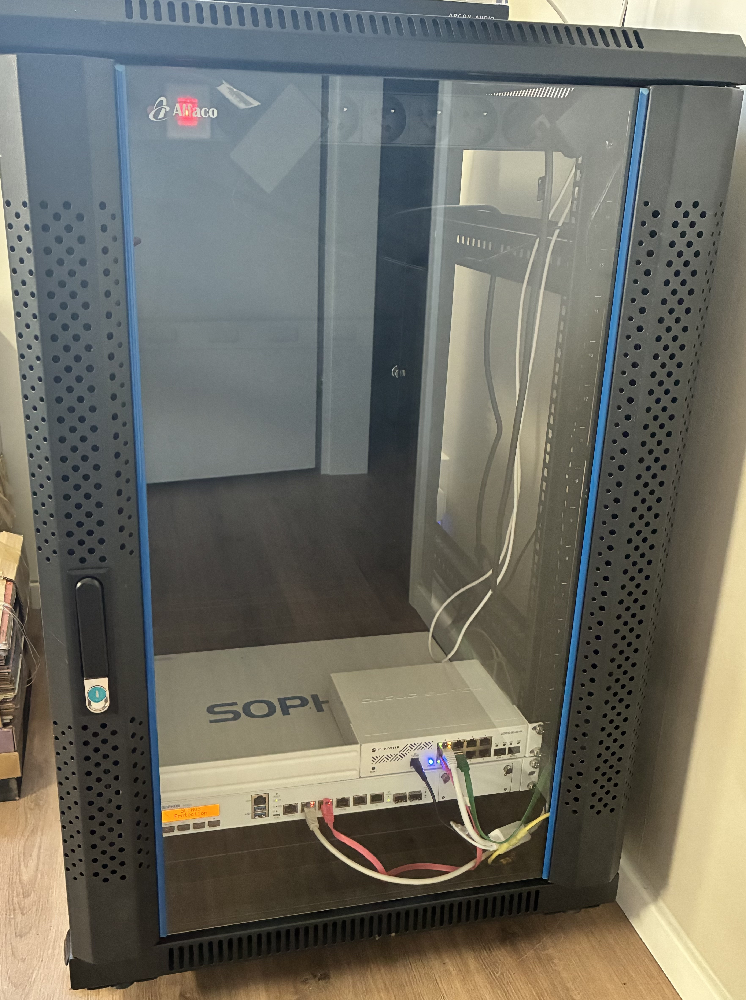
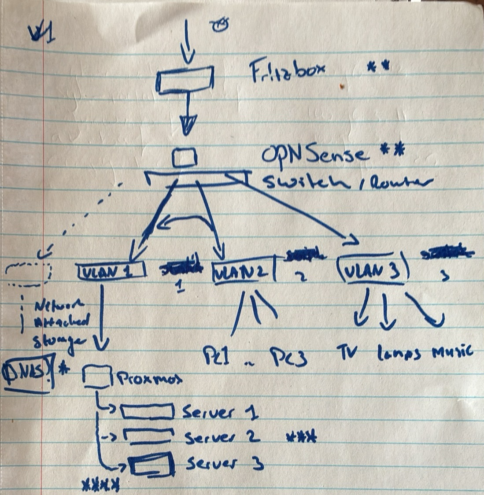

# Homelab

This isn't a getting-started guide, it's a log. I'm writing it for myself so that future-me remembers why I made certain decisions. If you stumbled here and find something useful, great. If you have some have tips & tricks for me, I'd also love to know!

_Started: 29/03/2026_

## Why bother?

I've wanted a homelab for years but never had the space. Moving house fixed that, and suddenly I had room for a rack, proper cable management and some dedicated hardware. Goals:

- Spin up apps locally without exposing them to the internet
- Practice networking and pick up some SOC/security skills
- Run local LLMs
- Separate trusted from untrusted devices
- Figure out where I stand on EU-native commodity hardware (this became a rabbit hole of its own, but affordable options exist if you look for them)

## Hardware

Went with a 19-inch rack, which opened up more affordable options than mini PCs, especially staying within EU vendors.

Plenty of room to grow.

### Networking

I wanted full control over traffic separation from the start: trusted vs untrusted devices, plus a sandbox for apps and LLMs. That meant:

- 1 Gbit/s+ ethernet (SFP+ or RJ45, ideally 10 Gbit/s)
- APs with multi-SSID and VLAN support
- Good 2.4 GHz coverage across the house
- Managed switch for VLAN tagging
- Dedicated firewall

What I ended up with (staying EU-native where possible):

| Role | Device | Cost |
|---|---|---|
| Firewall | Sophos SG125 | €175 |
| Managed switch | MikroTik CSS610-8G-2S+IN | €85 |
| Access points | 2× MikroTik AX AP | €200 |

My initial sketch of the network layout, drawn before we even moved:

### Compute, storage & GPU

Reusing an old 2014 desktop for now to keep costs down:

- Intel Core i7-4xxx
- 16 GB RAM
- Dedicated GPU
- 2× SSDs (128 GB + 256 GB)

This doubles as storage for now. Eventually I want separate boxes for storage and GPU/LLM work, but budget says not yet.

## Software & maintenance

Getting things running is the easy part. Keeping them running is the real challenge. I'm using **Ansible** and **Terraform** to manage services, handle updates and provision new stuff when I need it. Everything lives in this repo.

## Findings

Running notes as I go:

- Hard to find an affordable single device that handles firewall, WireGuard and IDS/IPS with enough headroom
