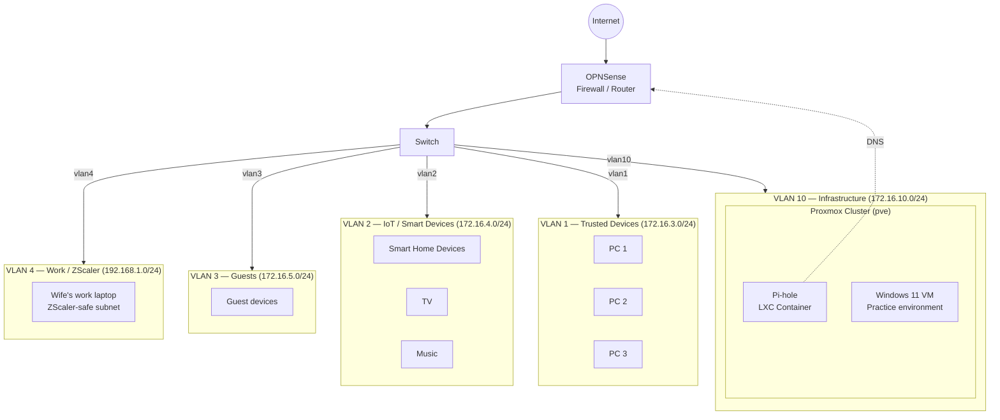

# Networking notes
This will contain my notes on my networking decisions, mostly setup on my MikroTik and Sophos device. These need additional attention in this log because there is no configuration as code and, as of yet, no backups available either.

## Challenges:
- Segregate smart devices from trusted network, this is harder than expected because some of the untrusted devices need to be accessed via a bigger set of protocols such as mDNS repeater. This resulted in a bigger ruleset to allow traffic from and to my trusted devices than I had hoped.
- Segregate a development environment/sandbox environment from trusted net
- My wife started having connectivity issues with her work laptop. Turns out that they use ZScaler that also hands out IP-addresses in the 172.16.0.0/12 CIDR range. I setup a separate network for her to get a 192.168.0.0/16 ranged IP address when on that device.

## Network Design

